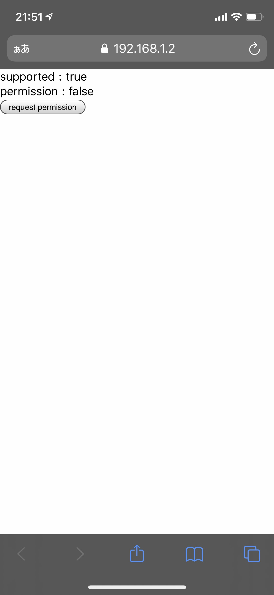
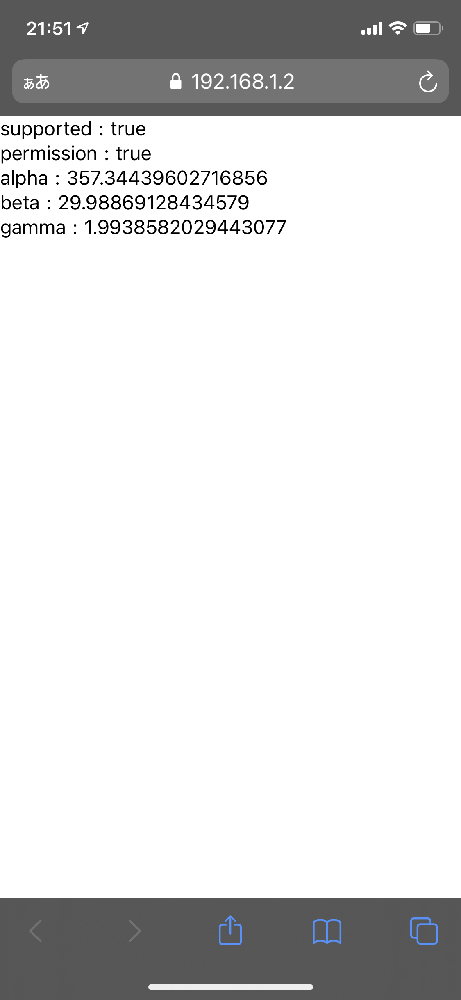

## demo

DeviceOrientation の使えるタッチデバイスで確認できます。




#### nuxt

```
cd demo/nuxt
npm install
npm run dev
```

localhost:3000 で起動します。

#### https

スマートフォンの場合、https にする必要があるため、手軽に https するために docker を使います。

```
cd demo/docker
```

docker-compose.yml の IP を編集

```yml
DOMAINS: "192.168.xxx.xxx -> http://host.docker.internal:3000"
```

docker を起動

```
docker-compose up
```

スマートフォンからhttps://192.168.xxx.xxx:3443にアクセスすると、httpsでnuxtにつながります。
